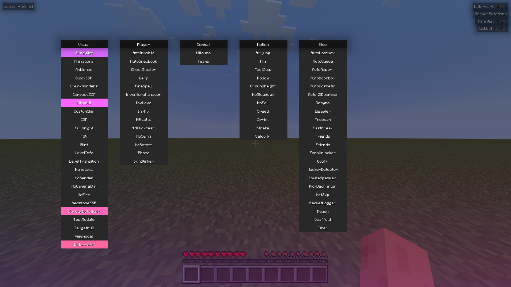

# List of contents

- This is an archive of different *Minecraft Bedrock* client releases -  ***aeolus**, **aeolus v2** and **zephyr***
- Since these projects currently have no future plans and aren't being maintained by me, I'd figured I post a public archive of their last versions
- You will an injector to load these modules into your game - *I recommend using [FateInjector](https://github.com/fligger/FateInjector) for this*
- Source code and or updates will not be provided - *please don't ask for either of these*

# aeolus v2

- The target version is for **v1.20.62**: *last updated August 2024*
- You can find this version [here](https://github.com/disepi/aeolus-releases/releases/tag/aeolusv2-v1.20.62)

# aeolus

- The target version is for **v1.19.70**: *last updated June 2023*
- You can find this version [here](https://github.com/disepi/aeolus-releases/releases/tag/aeolus-v1.19.70)

# zephyr

- There is a range of different versions available: *each version of the client will vary with the game version it is targeted for*
- You can browse the archived files [here](https://github.com/disepi/aeolus-releases/tree/main/zephyr)
